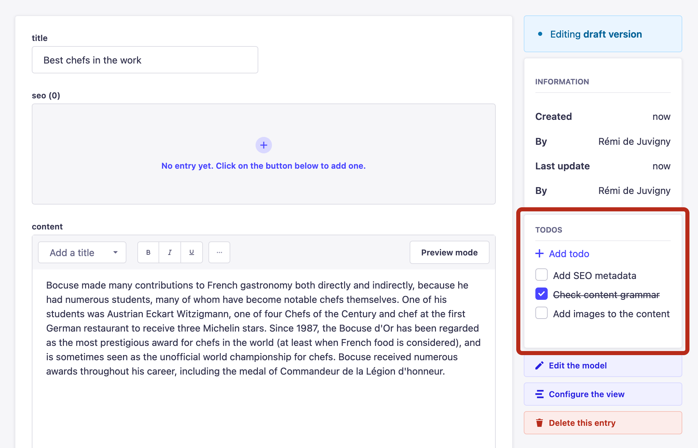

# strapi-plugin-todo


This plugin adds a todo list next to your content in Strapi. It makes it easy for admin users to keep track of their content management.




### Installation

Start by adding the plugin as dependency in your Strapi app:

```sh
# Using Yarn
yarn add strapi-plugin-todo

# Or using npm
npm install strapi-plugin-todo
```

Then build & restart your application:

```sh
# Using Yarn
yarn build && yarn develop

# Or using npm
npm run build && npm run develop
```

### Features & roadmap

- [x] Create a task
- [x] Toggle a task
- [x] Delete a task
- [x] Update a task
- [ ] Assign a task to a Strapi admin
- [ ] Set a due date for a task

### Development process

To find out more about how this plugin was built:

- Watch the ["Building, Shipping and Sharing Plugins" workshop](https://www.youtube.com/watch?v=0xPAEDJBGJY)
- Read the ["How to create a Strapi v4 plugin" series](https://strapi.io/blog/how-to-create-a-strapi-v4-plugin-generate-a-plugin-1-6)

### Credits

- Design by [Raffaele Gesulfo](https://twitter.com/rgesulfo)
- Dev by [Rémi de Juvigny](https://twitter.com/remidej)
- ❤️ and support by the [Strapi team](https://strapi.io/careers)
